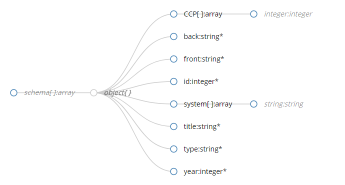

# Schema Information 

#### _Version 2_

This file describes the database structure that shall be used in the **official card database** (`common/cards/card.store.ts`).

A JSON Schema (_Draft-v4 standard_) is avaliable [here](./schema.json).

## Schema in short

The database is made up of a base `Array`, filled with various `Object`s - each card is its own `Object`.

Name | Key | Data type | Description | Required? |
--- | --- | --- | --- | --- |
ID | `id` | `Number` | A **unique** ID for each card that can be used to share said card. | Yes
Front of card | `front` | `string` | Contains the text for the front of the card. | Yes
Back of card | `back` | `string` | Contains the text for the back of the card. Can contain `html` tags for ease of formatting. | Yes
Title | `title` | `string` | Contains the title of the card to be displayed when selecting cards | Yes
Type | `type` | `string` | Contains the skill type key (_[Skill Type Keys](#skill-type-keys)_). | Yes
Year (SiP teaching) | `year` | `Number` | Contains the year of which the content of the card is taught in. A number from 1 to 3. | Yes
Core Clinical Problem | `CCP` | `Array` (of `Number`) | An array that contains `Number` type of each Core Clinical Problem number. Can be multiple CCPs. | **No**
System | `system` | `Array` (of `string`) | Contains the system key (_[System Keys](#system-keys)_). Can be multiple systems. | **No**

### System Keys

Name of System | Year of teaching | System key
--- | --- | --- |
Principles | 1 | `princ`
Respiratory | 1 | `resp`
Cardiovascular | 1 | `cardio`
Gastrointestinal | 1 | `gi`
Dermatology | 2 | `derm`
Musculoskeletal | 2 | `msk`
Endocrine | 2 | `endo`
Child and Family | 2 | `paeds`
Ophthalmology | 2 | `ophthal`
Ears, Nose and Throat | 2 | `ENT`
Renal | 2 | `renal`
Urology | 2 | `urol` 
Ageing | 3 | `age`
Neurology | 3 | `neuro`
Psychiatry | 3 | `psych`
Obstetrics and Gynaecology | 3 | `obgyn`
Haematology | 3 | `haem`
Microbiology | _n/a_ | `microbio` 
Pharmacology | _n/a_ | `pharma` 
Ethics & Law | _n/a_ | `ethlaw` 
General Practice | _n/a_ | `gp`
Public Health | _n/a_ | `pubhealth`
Radiology | _n/a_ | `radiol`

### Skill Type Keys

Name of Skill Type | Skill Key
--- | --- |
Risk | `risk`
Health Promotion | `healthpromo`
Types of Consultation/Skills | `typesofconsul`
Interpreting Results | `interpret`
Consent & Procedures | `consentproc`
Explanation & Planning | `explainplan`
Explaining Diseases | `explaindisease`

## Schema Visualised

